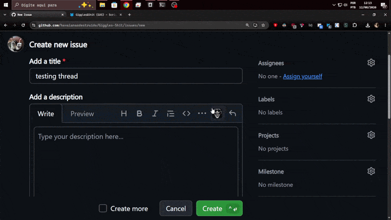

# Giggles & Shit (GAS for short)

## Star History

<a href="https://www.star-history.com/?repos=havaianasdestruido%2FGiggles-Shit&type=date&legend=top-left">
 <picture>
   <source media="(prefers-color-scheme: dark)" srcset="https://api.star-history.com/chart?repos=havaianasdestruido/Giggles-Shit&type=date&theme=dark&legend=top-left" />
   <source media="(prefers-color-scheme: light)" srcset="https://api.star-history.com/chart?repos=havaianasdestruido/Giggles-Shit&type=date&legend=top-left" />
   
 </picture>
</a>

simple userscript for custom emojis on github



## Documentation & website

- **Website:** <https://havaianasdestruido.github.io/Giggles-Shit/> — landing page, features, install guide, FAQ (built with **Jekyll**)
- **Docs:** <https://havaianasdestruido.github.io/Giggles-Shit/docs/> — full codebase documentation: getting started, usage guides, architecture, function reference, debug API (built with **Docusaurus**, served only under `/docs`)

### How the site pipeline works

| Part | Engine | Source | Served from |
|---|---|---|---|
| Primary website | Jekyll | repo root (`_config.yml`, `index.md`, `pages/`, `_layouts/`, `assets/`) | `/` |
| Documentation | Docusaurus | [`website/`](website/) | `/docs` |

[`.github/workflows/pages.yml`](.github/workflows/pages.yml) builds Docusaurus, copies
`website/build` into `_site/docs`, builds the Jekyll site, and deploys the merged `_site` to
GitHub Pages. One-time setup: **Settings → Pages → Source = "GitHub Actions"**.

### Local development

```bash
# primary website (Jekyll)
bundle install
bundle exec jekyll serve --baseurl ''      # http://localhost:4000

# documentation (Docusaurus) — hot-reloading dev server
cd website
npm install
npm start                                  # http://localhost:3000/docs

# combined preview (no Ruby needed: simulates the Jekyll render and
# merges the Docusaurus build under /docs, like production)
cd website && npm run build && cd ..
node scripts/serve-preview.js              # http://localhost:3000
```
